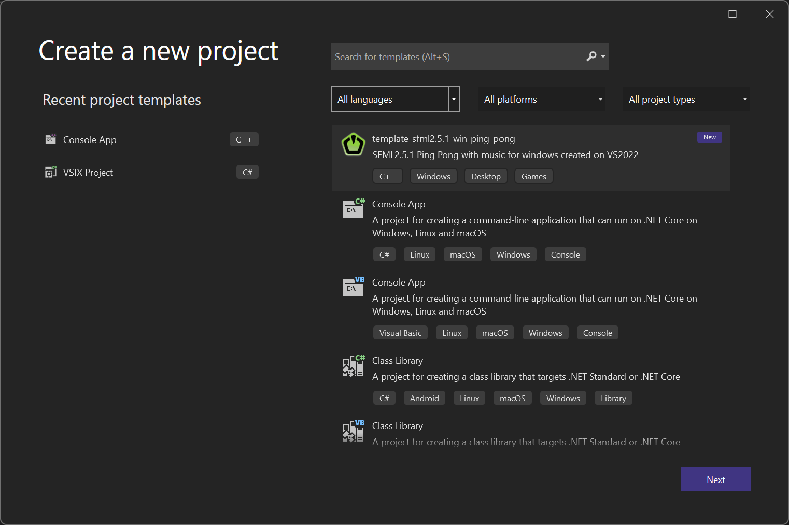

# vs-template-sfml2.5.1-win-ping-pong

> SFML2.5.1 Ping Pong with music for Windows created on VS2022

 

**This template for simple start in developing on SFML** 

### Configurations:
- Debug Static x64 | x86
- Debug Dynamic x64 | x86
- Release Static x64 | x86
- Release Dynamic x64 | x86

## Template in Visual Studio

### Installation:
> Need copy `template-sfml2.5.1-win-ping-pong.zip` to 
> **C:\Users\USER_NAME\Documents\Visual Studio 2022\Templates\ProjectTemplates**

> You can open folder through Explorer **Documents\Visual Studio 2022\Templates\ProjectTemplates**

## For work SFML2.5.1 need install component through Visual Studio Installer

In tab `Workloads` need set checkbox to
- Game development in C++

In tab `Individual components` need set checkbox to
- MSVC version 141 - C++ Build tools for VS 2017 for x64 or x86

## Для работы SFML2.5.1 нужно установить компоненты Visual Studio Installer

Во вкладке `Рабочие нагрузки` нужно установить флаг
- Разработка игр на языке C++

Во вкладке `Отдельные компоненты` нужно установить флаг
- MSVC версии 141 — средства сборки C++ для VS 2017 для x64 или x86

### Donations
* [PayPal](https://www.paypal.com/paypalme/dmitriy3342)
